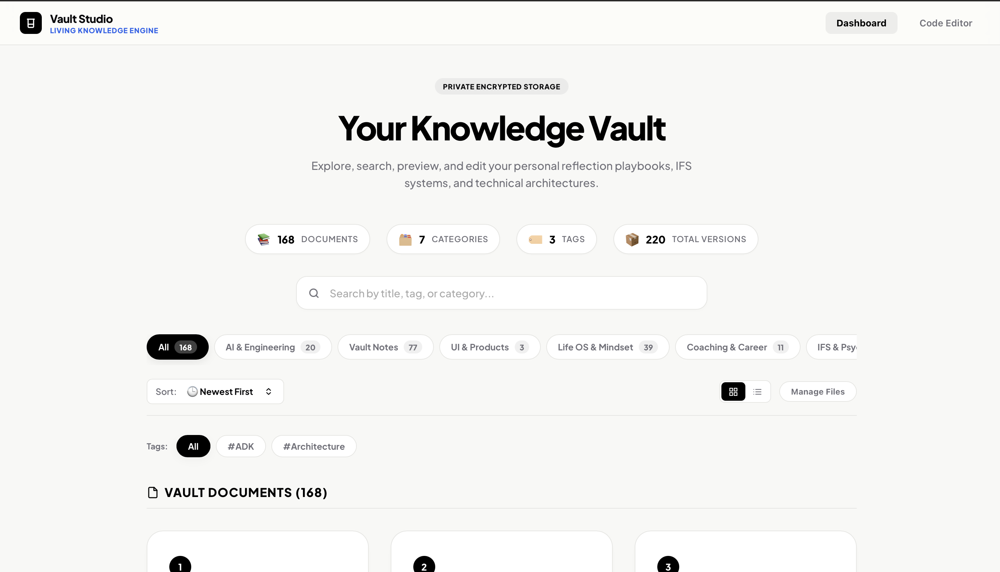
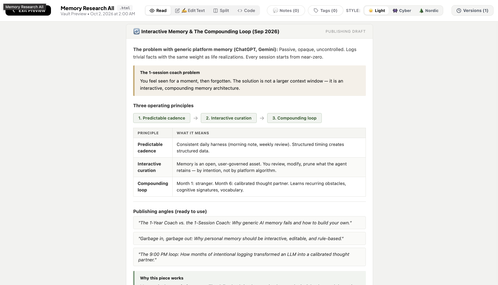

# Agent Hub

**A private, beautiful knowledge vault for your AI agents. Connects to any AI assistant via MCP.**

We have AI agents doing research, writing docs, and analyzing code for us constantly. But where does that output go? Usually, it's lost in chat logs. Agent Hub connects to **any agent** (Claude Desktop, Cursor, or custom frameworks) via **MCP (Model Context Protocol)** to give your AI a secure place to publish styled, readable pages that you can browse later.

*Your agent writes it in raw Markdown. Agent Hub displays it as a beautiful, premium webpage.*

### 🚀 Core Functionality
- **Agent-Driven Publishing**: Your AI agent saves research, reports, and dashboards directly to your vault via MCP.
- **Manual Uploads**: You can also easily drop your own `.md` or `.html` files in manually through the UI.
- **Instant Auto-Styling**: Just upload a raw Markdown file, and Agent Hub instantly renders it into a highly-aesthetic, premium HTML view.
- **Private & Secure**: Locked behind your own authentication portal. This is a private dashboard for you, not a public blog.


*Your private knowledge vault, automatically categorized and searchable.*


*Instantly renders Markdown into beautiful layouts with custom themes like Nordic, Cyber, and Light.*

---

## ⚡ Quick Test (No Agent Required)
Want to see the premium rendering before setting up an agent?
1. Start the app (`npm run dev`).
2. Click the upload button in the UI and drop any `.md` or `.html` file.
3. Watch it instantly render your Markdown into the gorgeous Nordic or Cyber themes.

---

## 🔌 MCP Integration (Connecting Your Agent)

Agent Hub exposes a set of powerful MCP tools so any agent can interact with the vault directly:

- `agenthub_publish_page`: Upload HTML or Markdown content, apply a title and tags, and get back the published Vault URL.
- `agenthub_search_vault`: Query the vault for pages by title, tags, or file type.
- `agenthub_get_page`: Retrieve the raw content of a specific page so your agent can read, iterate, and refine it.
- `agenthub_delete_page`: Remove a page from the vault entirely.

---

## 🚀 Key Features & Hybrid Document Engine

The vault uses a intelligent, three-tier hybrid compiler to render files according to their type with pixel-perfect accuracy:

1. **Structured Markdown (`.md`)**: Automatically parsed on-the-fly into gorgeous premium articles. Preserves list checkboxes, headers, inline highlights, code blocks, and lists under our customizable themes.
2. **Agent Hub JSON Dashboards**: Renders specialized workout/physiotherapy JSON structures into a premium, interactive multi-tab dashboard with custom stats cards, exercise meters, and workout progress timelines.
3. **Native HTML Pages (`.html`)**: Standard uploaded HTML documents are served natively using direct Vercel Blob proxy endpoints, completely preserving complex layouts, client-side scripts, animations, and embedded stylesheet resources.

---

## 🎨 Three Elegant Visual Themes

You can toggle between **3 curated aesthetic themes** instantly directly from the macOS-style segmented toolbar at the top of the viewer:

* ☀️ **Clean Light**
  * *Typography*: `Plus Jakarta Sans`
  * *Aesthetic*: Minimalist, GCP-inspired clean design featuring modern typography, warm-gray borders, soft card containers, and off-white backdrops.
* 👾 **Sleek Cyber**
  * *Typography*: `JetBrains Mono`
  * *Aesthetic*: Immersive hacker environment with custom retro glow filters, neon cyber accents (`#66FCF1`), dark terminal layouts, and high-contrast monospace tables.
* 🌲 **Nordic Forest**
  * *Typography*: `Plus Jakarta Sans`
  * *Aesthetic*: Warm, organic, editorial editorial layout featuring deep evergreen text, warm cream card overlays, and 32px hyper-rounded pill corners.

---

## 🏗️ Architecture & Decoupled Iframe Loading

### Intelligent Iframe Rendering
To ensure security and bypass cross-origin restrictions (`X-Frame-Options` and `Content-Security-Policy` from storage backends), the app utilizes an optimized double-channel system:
* **Direct Sandbox Channel (`src`)**: Natively points the iframe to the Vercel Blob URL for original `.html` files, resolving relative stylesheets, paths, and image assets seamlessly.
* **Parsed Dynamic Channel (`srcDoc`)**: Compiles Markdown and JSON into custom styled wrappers inside a safe `sandbox="allow-scripts allow-same-origin allow-popups allow-forms"` iframe.
* **Loading synchronization**: The iframe only initializes once processing completes, eliminating eager browser background fetches and double-loading glitches.

### Privacy Gate
Edge Middleware intercepts all request layers, demanding a secure session cookie via a custom `VAULT_PASSWORD` portal before granting access to document list queries or rendering proxies.

---

## 🏁 Getting Started

### Prerequisites
* Node.js 18.x or later
* Vercel Blob Account

### Environment Setup
Create a `.env` in the root folder containing:
```env
# Vercel Blob Token
BLOB_READ_WRITE_TOKEN="vercel_blob_rw_..."

# Security Gates
UPLOAD_SECRET="local_secret_123"
VAULT_PASSWORD="secure_vault_password"
```

### Installation & Launch
1. Install dependencies:
   ```bash
   npm install
   ```
2. Launch development environment:
   ```bash
   npm run dev
   ```
3. Compile production-ready Next.js bundle:
   ```bash
   npm run build
   ```

---

## ✍️ Custom HTML Style Guidelines

For static HTML pages you want to upload directly while preserving visual unity with the GCP Light look, drop this in your `<head>` block:
```html
<style>
  body {
    font-family: 'Plus Jakarta Sans', system-ui, sans-serif;
    background-color: #F8F8F6; /* Warm off-white */
    color: #1C1917;            /* Charcoal */
    padding: 3rem 1.5rem;
    margin: 0;
  }
  .container {
    max-width: 800px;
    margin: 0 auto;
    background: #FFFFFF;       /* Card overlay */
    border: 1px solid #E6E6E3; /* Warm-gray border */
    border-radius: 24px;       /* Smooth corners */
    padding: 3.5rem 3rem;
    box-shadow: 0 1px 3px rgba(0,0,0,0.01), 0 20px 40px -15px rgba(0,0,0,0.03);
  }
  h1 { color: #09090B; letter-spacing: -0.04em; margin-bottom: 0.75rem; }
  p { color: #78716C; line-height: 1.6; font-size: 0.95rem; }
</style>
```

---

## 🧪 Testing

The core document aggregation and versioning engine is backed by automated grouping tests. You can run the test suite locally using:

```bash
npm test
```

This executes the mathematical grouping validation in `test-grouping.js`, which ensures that multiple versions of uploaded documents (HTML or Markdown) are correctly sorted chronologically and that the absolute latest version is consistently served as the primary document in the viewer.

---
MIT License
